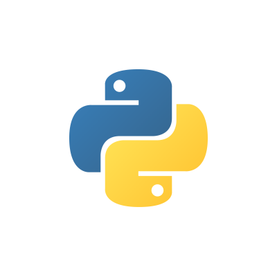

# Python-coursework 🚀

Welcome to my repository for **university coursework**, where I showcase labs, assignments, practice exercises, and tests completed as part of my learning journey with **Python**. 🐍

## About 📘

This repository reflects my academic progress and highlights my coding proficiency and problem-solving skills using Python.

It contains:
- **Labs**: Hands-on programming tasks.
- **Assignments**: Larger projects integrating multiple concepts.
- **Practice**: Small exercises to reinforce key topics.
- **Tests**: Course evaluations testing key skills.

## Prerequisites 🛠️

To run the code in this repository, you need:
- [Python 3.13.1](https://www.python.org/downloads/) installed on your system.
